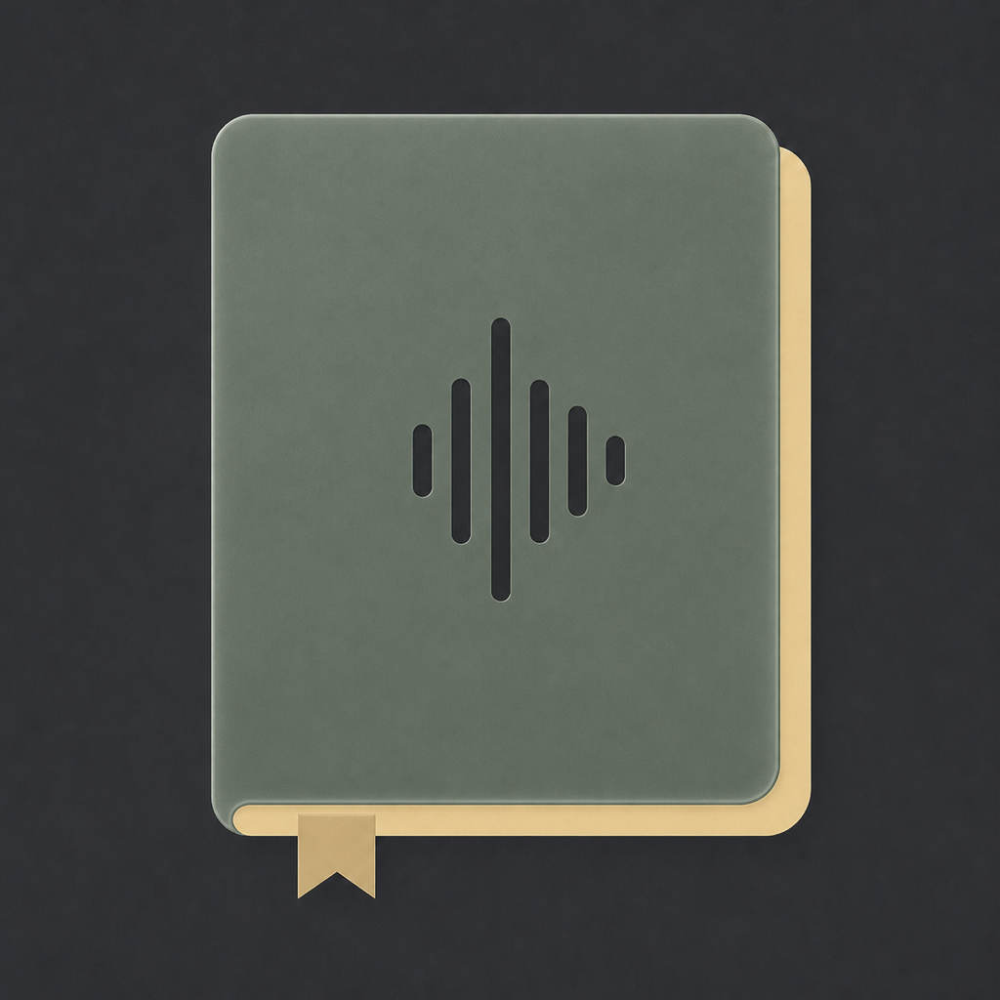

<p align="center">
  
</p>

<h1 align="center">声页</h1>

<p align="center">
  macOS 本地朗读阅读器 · 完全免费 · 开源 · 无广告
</p>

> [!IMPORTANT]
> **目前只提供 macOS 版本。** 不支持 iPhone、iPad、Windows、Android 或 Linux。

声页是一款轻量、纯净的原生 macOS 阅读软件。导入 EPUB 或 TXT 后，可以
单击任意一句话开始朗读；当前句子会自动高亮，朗读跨页时页面也会自动
翻到对应位置。朗读使用 macOS 自带语音引擎，在本机离线完成。1.2.1 版
新增封面书架、按日期分组的观看历史和注释快捷清除功能。

## 下载

前往 [Releases](https://github.com/Andy9223/ShengYe/releases/latest)
下载最新版：

- `VoicePage-v1.2.1-macOS-universal.dmg`：推荐安装包
- `VoicePage-v1.2.1-macOS-universal.zip`：备用压缩包

本版本完全免费、开源且无广告。

## 支持的设备与系统

| 项目 | 当前支持范围 |
|---|---|
| 平台 | 仅 macOS |
| 最低系统 | macOS 14 Sonoma |
| Apple 芯片 | 支持 M 系列 Mac |
| Intel 芯片 | 支持能够运行 macOS 14 的 Intel Mac |
| 安装包架构 | Universal 2（`arm64` + `x86_64`） |
| 电子书格式 | 无 DRM 的 EPUB 2/3、TXT |

系统可用朗读音色取决于这台 Mac 已安装的 macOS 系统语音。

## 使用方式

1. 在首页点击“导入图书”，选择无 DRM 的 EPUB 或 TXT。
2. 图书会自动加入“我的图书”，以后可以直接从封面书架再次打开。
3. 在阅读页单击任意一句话，即可从这句话开始朗读。
4. 打开右侧阅读设置，可以选择音色、调整语速和字号、开启自动跟随翻页，
   或设置定时停止。
5. 拖动选择文字并右键，可以高亮、添加注释、加下划线、翻译或拷贝。

## 功能介绍

### 本地书架与阅读进度

- “我的图书”以封面书架展示已导入书籍，支持上下滚动浏览。
- EPUB 会优先显示书籍原封面；TXT 或缺少封面的 EPUB 使用本地占位封面。
- 每本书独立保存章节与阅读位置，首页可以一键继续上次阅读。
- 观看历史按“今日、昨日、前天、更早”分组，支持删除单条记录和批量管理。

### 朗读与自动翻页

- 单击任意一句话，从当前句开始朗读，并实时高亮正在朗读的句子。
- 开启“跟随朗读自动翻页”后，朗读跨页时页面会自动移动到对应位置。
- 朗读时仍可手动翻页；点击“返回朗读位置”即可重新跟随当前语音。
- 连续朗读自然段和章节，减少段落切换时的机械停顿。

### 本地音色中心

- 集中管理系统标准、增强和高级音色，可搜索、试听、收藏并直接选择。
- 可以从首页前往 macOS 系统音色管理，下载更自然的增强或高级音色。
- Apple 芯片 Mac 可调用经过授权的 macOS“个人声音”。
- 书籍正文和个人声音均由 macOS 在本机处理，声页不会上传声音或文本。

### 阅读显示与操作

- 字号变化后自动重新分页：字号越大，每页文字越少；字号越小，每页文字越多。
- 只需左右翻页，不需要上下滚动阅读正文。
- 支持白天、黑夜、跟随系统外观，以及低饱和暖绿护眼模式。
- 可以单独调节阅读页面亮度，不改变 Mac 的系统屏幕亮度。
- 全屏模式自适应窗口尺寸，并显示电量、时间和阅读进度。
- 支持键盘、触控板翻页和方向过渡动画。

### 文字批注

- 可以选择一个字符、一句话或任意一段文字进行批注。
- 支持五种高亮颜色、注释和下划线，并保存在本机。
- 已添加注释的文字可通过右键菜单快速编辑或清除注释。
- 清除注释不会同时删除已有高亮或下划线。
- 选中文字后可以调用系统翻译或拷贝。

### 章节与停止条件

- 支持章节目录跳转、上一章、下一章、上一页和下一页。
- 支持 10、20、30、60 分钟定时关闭。
- 可以选择“读完本小节”或“读完本章”后停止朗读。

## 键盘与触控板

| 操作 | 功能 |
|---|---|
| `fn + F9` | 下一章 |
| `fn + F7` | 上一章 |
| `空格` | 播放 / 暂停 |
| `←` / `→` | 上一页 / 下一页 |
| 两指右滑 / 左滑 | 上一页 / 下一页 |
| `Esc` | 退出应用 |

> 若在 macOS 的鼠标设置中开启了“自然滚动”，触控板双指翻页方向可能与上表描述相反。

## 安装方法

### 使用 DMG

1. 下载并打开 DMG。
2. 将“声页”拖入 `Applications` 文件夹。
3. 从“应用程序”中打开声页。

### 首次打开提示

当前发布包尚未使用 Apple Developer ID 公证。若 macOS 阻止首次
启动，请在 Finder 中右键“声页”并选择“打开”；如仍被阻止，可前往
“系统设置 → 隐私与安全性”选择“仍要打开”。

## 从源代码构建

需要 macOS 14 或更高版本，以及 Apple Swift 5.10 或更高版本。

```sh
git clone https://github.com/Andy9223/ShengYe.git
cd ShengYe
zsh scripts/check-parser.sh
zsh scripts/build-app.sh
```

构建脚本会生成 Universal 2 的 `声页.app`、ZIP 和 DMG。

## 隐私与格式限制

- 朗读、分页和阅读进度都在本机完成。
- 不收集遥测，不使用云端朗读，不包含广告。
- Apple Books 中带 DRM 的已购内容无法导入。
- 复杂固定版式 EPUB 和漫画暂不支持。
- 页面亮度仅影响阅读页面，不改变系统屏幕亮度。
- 系统翻译需要 macOS 14.4 或更高版本。
- “个人声音”仅支持符合 Apple 要求的 Apple 芯片 Mac。

更多说明见 [隐私说明](PRIVACY.md)。

## 开源许可证

声页及本仓库源代码按
[GNU General Public License v3.0](LICENSE) 发布。你可以运行、研究、
修改和再分发，但分发衍生版本时也必须遵守 GPL-3.0 并提供对应源代码。

Copyright © 2026 Andy9223.
